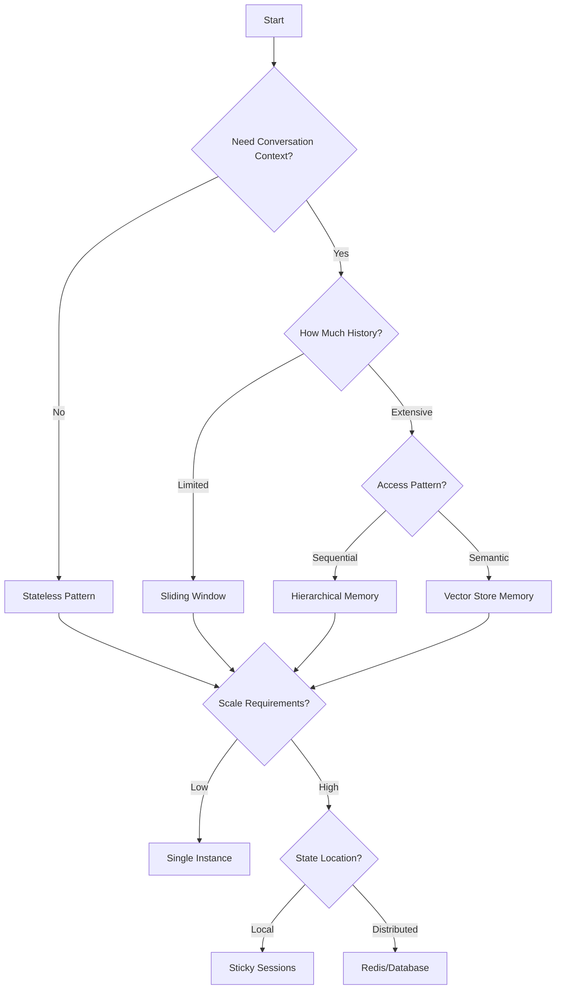

# 🏗️ Architectural Patterns for AI Chat Applications

## Table of Contents
1. [Pattern Overview](#pattern-overview)
2. [Conversation Patterns](#conversation-patterns)
3. [Memory Patterns](#memory-patterns)
4. [Integration Patterns](#integration-patterns)
5. [Scaling Patterns](#scaling-patterns)
6. [Security Patterns](#security-patterns)
7. [Decision Framework](#decision-framework)

## Pattern Overview

This guide explains the architectural patterns used throughout the Spring AI chat modules and, more importantly, **WHY** each pattern exists and **WHEN** to use it.

## Conversation Patterns

### 1. Stateless Single-Turn Pattern

```java
@PostMapping("/chat")
public String chat(@RequestBody String message) {
    return chatClient.prompt().user(message).call().content();
}
```

**When to Use:**
- ✅ Simple Q&A applications
- ✅ Translation services
- ✅ One-time analysis tasks
- ✅ High-volume, low-context scenarios

**Why This Pattern?**
- **Scalability** - Any instance can handle any request
- **Simplicity** - No state management complexity
- **Cost** - Minimal token usage
- **Performance** - No memory lookup overhead

**Real-World Example:**
A customer service FAQ bot where each question is independent:
```
User: "What are your business hours?"
Bot: "We're open Monday-Friday, 9 AM - 5 PM EST."
```

### 2. Stateful Multi-Turn Pattern

```java
@Service
public class ConversationService {
    private final ChatMemory memory;
    
    public String chat(String conversationId, String message) {
        return chatClient.prompt()
            .user(message)
            .advisors(a -> a.param(CONVERSATION_ID, conversationId))
            .call()
            .content();
    }
}
```

**When to Use:**
- ✅ Personal assistants
- ✅ Technical support
- ✅ Educational tutoring
- ✅ Complex workflows

**Why This Pattern?**
- **Context Preservation** - Maintains conversation flow
- **User Experience** - Natural, human-like interaction
- **Task Completion** - Multi-step processes
- **Personalization** - Remembers user preferences

**Real-World Example:**
A technical support bot helping debug an issue:
```
User: "My application is crashing"
Bot: "I'll help you debug. What error message do you see?"
User: "NullPointerException in UserService"
Bot: "Based on the NullPointerException in UserService, let's check..."
```

### 3. Hybrid Pattern

```java
@Service
public class HybridChatService {
    public String quickAnswer(String question) {
        // Stateless for simple queries
        return chatClient.prompt().user(question).call().content();
    }
    
    public String contextualChat(String conversationId, String message) {
        // Stateful for complex interactions
        return chatClient.prompt()
            .user(message)
            .advisors(a -> a.param(CONVERSATION_ID, conversationId))
            .call()
            .content();
    }
}
```

**When to Use:**
- ✅ Mixed-use applications
- ✅ Optimizing costs
- ✅ Performance-sensitive systems

**Why This Pattern?**
- **Flexibility** - Right tool for each job
- **Optimization** - Use resources wisely
- **User Choice** - Let users decide complexity

## Memory Patterns

### 1. Sliding Window Memory

```java
MessageWindowChatMemory.builder()
    .maxMessages(20)
    .build()
```

**When to Use:**
- ✅ Most conversational applications
- ✅ Token-limited scenarios
- ✅ Real-time interactions

**Why This Pattern?**
- **Bounded Resources** - Predictable memory usage
- **Relevance** - Recent context usually most important
- **Performance** - Constant-time operations
- **Cost Control** - Limited tokens per request

**Configuration Guidelines:**
```java
// Short conversations (customer service)
.maxMessages(10)  // ~500-1000 tokens

// Medium conversations (tutoring)
.maxMessages(20)  // ~1000-2000 tokens

// Long conversations (therapy, coaching)
.maxMessages(50)  // ~2500-5000 tokens
```

### 2. Hierarchical Memory

```java
@Service
public class HierarchicalMemoryService {
    private final ChatMemory shortTerm;  // Recent 5 messages
    private final ChatMemory longTerm;   // Summaries
    private final ChatMemory episodic;   // Key events
    
    public String processWithMemory(String conversationId, String message) {
        // Combine different memory types
        List<Message> context = buildContext(conversationId, message);
        return processWithContext(context, message);
    }
}
```

**When to Use:**
- ✅ Long-running conversations
- ✅ Complex domain knowledge
- ✅ Personal AI assistants

**Why This Pattern?**
- **Efficiency** - Balance detail with overview
- **Scalability** - Manage very long conversations
- **Intelligence** - Different types of memory for different needs

### 3. Semantic Memory Pattern

```java
@Service
public class SemanticMemoryService {
    private final VectorStore vectorStore;
    
    public List<Message> getRelevantContext(String conversationId, String query) {
        // Find semantically similar past messages
        List<Document> similar = vectorStore.similaritySearch(
            SearchRequest.query(query)
                .withFilterExpression("conversationId == '" + conversationId + "'")
                .withTopK(5)
        );
        
        return convertToMessages(similar);
    }
}
```

**When to Use:**
- ✅ Knowledge-intensive applications
- ✅ Long conversation histories
- ✅ Cross-conversation learning

**Why This Pattern?**
- **Relevance** - Find related content regardless of recency
- **Efficiency** - Don't need entire history
- **Intelligence** - Semantic understanding

## Integration Patterns

### 1. Advisor Chain Pattern

```java
chatClient.prompt()
    .user(message)
    .advisors(
        loggingAdvisor,
        authenticationAdvisor,
        rateLimitingAdvisor,
        memoryAdvisor
    )
    .call()
```

**When to Use:**
- ✅ Cross-cutting concerns
- ✅ Enterprise applications
- ✅ Compliance requirements

**Why This Pattern?**
- **Separation of Concerns** - Each advisor has one job
- **Composability** - Mix and match behaviors
- **Testability** - Test each advisor independently
- **Maintainability** - Change behavior without touching core logic

**Common Advisor Types:**
1. **Logging** - Audit trail
2. **Security** - Authentication/authorization
3. **Monitoring** - Metrics and tracing
4. **Filtering** - Content moderation
5. **Enhancement** - Context enrichment

### 2. Circuit Breaker Pattern

```java
@Component
public class ResilientChatService {
    private final CircuitBreaker circuitBreaker;
    
    public String chat(String message) {
        return circuitBreaker.executeSupplier(() -> 
            chatClient.prompt().user(message).call().content()
        ).recover(throwable -> {
            logger.error("Chat service failed", throwable);
            return "I'm having trouble right now. Please try again later.";
        });
    }
}
```

**When to Use:**
- ✅ Production systems
- ✅ Multi-provider setups
- ✅ High-availability requirements

**Why This Pattern?**
- **Resilience** - Graceful degradation
- **User Experience** - Always provide response
- **System Protection** - Prevent cascade failures

### 3. Multi-Model Router Pattern

```java
@Service
public class ModelRouter {
    public ChatClient routeToModel(RequestContext context) {
        if (context.requiresHighAccuracy()) {
            return gpt4Client;
        } else if (context.requiresSpeed()) {
            return gpt35TurboClient;
        } else if (context.requiresCreativity()) {
            return gpt4Client.withHighTemperature();
        }
        return defaultClient;
    }
}
```

**When to Use:**
- ✅ Cost optimization
- ✅ Performance requirements vary
- ✅ Different use cases in one app

**Why This Pattern?**
- **Optimization** - Right model for each task
- **Cost Control** - Use expensive models only when needed
- **Performance** - Fast models for simple tasks

## Scaling Patterns

### 1. Conversation Affinity Pattern

```yaml
spring:
  session:
    store-type: redis
nginx:
  upstream:
    ip_hash: true  # Sticky sessions
```

**When to Use:**
- ✅ In-memory conversation storage
- ✅ WebSocket connections
- ✅ Stateful processing

**Why This Pattern?**
- **Simplicity** - No distributed state
- **Performance** - Local memory access
- **Consistency** - Same instance handles conversation

### 2. Distributed Memory Pattern

```java
@Configuration
public class DistributedMemoryConfig {
    @Bean
    public ChatMemoryRepository chatMemoryRepository(RedisTemplate redis) {
        return new RedisChatMemoryRepository(redis);
    }
}
```

**When to Use:**
- ✅ Multi-instance deployments
- ✅ High availability requirements
- ✅ Global scale applications

**Why This Pattern?**
- **Scalability** - Any instance can handle any request
- **Reliability** - Survives instance failures
- **Performance** - Cache frequently accessed data

### 3. Event-Driven Pattern

```java
@Service
public class EventDrivenChatService {
    @Autowired
    private KafkaTemplate<String, ChatEvent> kafkaTemplate;
    
    public void processMessageAsync(String conversationId, String message) {
        // Publish event
        kafkaTemplate.send("chat-requests", new ChatEvent(conversationId, message));
    }
    
    @KafkaListener(topics = "chat-requests")
    public void handleChatRequest(ChatEvent event) {
        // Process asynchronously
        String response = processMessage(event);
        publishResponse(event.getConversationId(), response);
    }
}
```

**When to Use:**
- ✅ Very high scale
- ✅ Async processing requirements
- ✅ Complex workflows

**Why This Pattern?**
- **Decoupling** - Separate request from processing
- **Scalability** - Process at your own pace
- **Reliability** - Message persistence

## Security Patterns

### 1. API Key Rotation Pattern

```java
@Component
public class ApiKeyManager {
    @Scheduled(cron = "0 0 0 * * *") // Daily
    public void rotateKeys() {
        String newKey = generateNewKey();
        updateConfiguration(newKey);
        scheduleOldKeyRemoval();
    }
}
```

**When to Use:**
- ✅ Production systems
- ✅ Compliance requirements
- ✅ High-security environments

**Why This Pattern?**
- **Security** - Limit exposure window
- **Compliance** - Meet security standards
- **Recovery** - Easy to revoke compromised keys

### 2. Content Filtering Pattern

```java
@Component
public class ContentFilterAdvisor implements Advisor {
    public AdvisedResponse advise(AdvisedRequest request) {
        if (containsProhibitedContent(request.getUserText())) {
            return new FilteredResponse("Content policy violation");
        }
        return chain.advise(request);
    }
}
```

**When to Use:**
- ✅ Public-facing applications
- ✅ Regulated industries
- ✅ Youth-oriented services

**Why This Pattern?**
- **Safety** - Prevent harmful content
- **Compliance** - Meet regulatory requirements
- **Brand Protection** - Maintain standards

## Decision Framework

### Choosing the Right Pattern



### Pattern Selection Criteria

| Factor | Stateless | Stateful | Distributed |
|--------|-----------|----------|-------------|
| Complexity | Low | Medium | High |
| Scalability | Excellent | Good | Excellent |
| Cost | Low | Medium | High |
| User Experience | Basic | Rich | Rich |
| Development Time | Fast | Medium | Slow |

### Anti-Patterns to Avoid

#### ❌ Over-Engineering
```java
// Don't use distributed memory for a demo
@Bean
public ChatMemory chatMemory() {
    return KubernetesDistributedQuantumMemory.builder()
        .withBlockchainPersistence()
        .build();
}
```

#### ✅ Start Simple
```java
// Use in-memory for demos and prototypes
@Bean
public ChatMemory chatMemory() {
    return MessageWindowChatMemory.builder()
        .chatMemoryRepository(new InMemoryChatMemoryRepository())
        .maxMessages(20)
        .build();
}
```

#### ❌ Ignoring Costs
```java
// Don't send entire history always
chatClient.prompt()
    .messages(getAllMessagesEver()) // 10,000 tokens!
    .call()
```

#### ✅ Be Cost-Conscious
```java
// Use sliding windows
chatClient.prompt()
    .user(message)
    .advisors(memoryAdvisor) // Manages window
    .call()
```

## Key Takeaways

1. **Choose patterns based on requirements**, not trends
2. **Start simple**, evolve as needed
3. **Consider the trade-offs** - every pattern has costs
4. **Combine patterns** for complex scenarios
5. **Monitor and measure** to validate choices
6. **Document your decisions** for future developers

## Next Steps

- 📄 [Performance Guide](performance.md) - Optimization strategies
- 📄 [Security Guide](../guides/security.md) - Security best practices
- 🚀 [Quick Start Guide](../guides/quick-start.md) - Get building!

---

[← Back to Architecture](../README.md#architecture--design-decisions) | [Performance Guide →](performance.md)