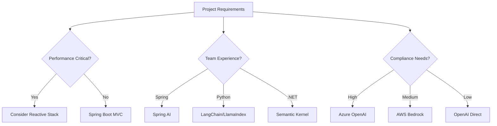

# 🔧 Technology Choices and Framework Comparison

## Overview

This guide explains the technology decisions behind the Spring AI Chat Applications project and compares Spring AI with alternative approaches. Understanding these choices helps you make informed decisions for your own projects.

## Table of Contents
1. [Why Spring AI Over Alternatives](#why-spring-ai-over-alternatives)
2. [Framework Comparison Matrix](#framework-comparison-matrix)
3. [Provider Selection Criteria](#provider-selection-criteria)
4. [Architecture Technology Stack](#architecture-technology-stack)
5. [Decision Framework](#decision-framework)

## Why Spring AI Over Alternatives

### The Problem Space

Building AI-powered applications involves several challenges:
- **Provider Integration** - Each AI provider has different APIs
- **Conversation Management** - Maintaining context across interactions
- **Error Handling** - Dealing with rate limits, timeouts, and failures
- **Testing** - How do you test AI interactions reliably?
- **Production Concerns** - Monitoring, security, and cost management

### Spring AI's Solution

```java
// Before Spring AI - Direct OpenAI Integration
@Service
public class DirectOpenAIService {
    private final OpenAIClient openAIClient;
    private final Map<String, List<ChatMessage>> conversations = new ConcurrentHashMap<>();
    
    public String chat(String conversationId, String message) {
        try {
            // Manual conversation management
            List<ChatMessage> history = conversations.computeIfAbsent(conversationId, k -> new ArrayList<>());
            history.add(new ChatMessage("user", message));
            
            // Manual API call construction
            ChatCompletionRequest request = ChatCompletionRequest.builder()
                .model("gpt-4")
                .messages(history)
                .temperature(0.7)
                .build();
                
            // Manual error handling and parsing
            ChatCompletionResult result = openAIClient.createChatCompletion(request);
            String response = result.getChoices().get(0).getMessage().getContent();
            
            history.add(new ChatMessage("assistant", response));
            return response;
            
        } catch (Exception e) {
            // Manual error handling
            logger.error("Chat failed", e);
            throw new ChatException("Failed to process message", e);
        }
    }
}
```

```java
// With Spring AI - Clean, Maintainable
@Service
public class SpringAIChatService {
    private final ChatClient chatClient;
    
    public SpringAIChatService(ChatClient.Builder builder) {
        this.chatClient = builder
            .defaultAdvisors(MessageChatMemoryAdvisor.builder(chatMemory).build())
            .build();
    }
    
    public String chat(String conversationId, String message) {
        return chatClient.prompt()
            .user(message)
            .advisors(a -> a.param(ChatMemory.CONVERSATION_ID, conversationId))
            .call()
            .content();
    }
}
```

**Why Spring AI Wins:**
- **Abstraction** - Hide provider-specific details
- **Convention over Configuration** - Sensible defaults
- **Spring Integration** - Leverages Spring ecosystem
- **Type Safety** - Compile-time checking
- **Testability** - Easy mocking and testing
- **Extensibility** - Advisor pattern for cross-cutting concerns

## Framework Comparison Matrix

### AI Framework Comparison

| Feature | Spring AI | LangChain4j | Direct APIs | LlamaIndex | Semantic Kernel |
|---------|-----------|-------------|-------------|------------|-----------------|
| **Language** | Java | Java | Various | Python | C#/Python |
| **Learning Curve** | Medium | Medium | High | Medium | Medium |
| **Spring Integration** | ✅ Native | ⚠️ Manual | ❌ None | ❌ None | ❌ None |
| **Type Safety** | ✅ Full | ✅ Full | ⚠️ Partial | ❌ Dynamic | ✅ Full |
| **Memory Management** | ✅ Built-in | ✅ Built-in | ❌ Manual | ✅ Built-in | ✅ Built-in |
| **Provider Abstraction** | ✅ Excellent | ✅ Good | ❌ None | ✅ Good | ✅ Good |
| **Streaming Support** | ✅ Native | ✅ Native | ⚠️ Manual | ✅ Native | ✅ Native |
| **Testing Support** | ✅ Excellent | ⚠️ Basic | ❌ Manual | ⚠️ Basic | ⚠️ Basic |
| **Enterprise Features** | ✅ Full | ⚠️ Limited | ❌ Manual | ⚠️ Limited | ✅ Good |

### Detailed Comparison

#### Spring AI Advantages
```java
// ✅ Auto-configuration
@SpringBootApplication
public class ChatApp {
    // ChatClient auto-configured with sensible defaults
}

// ✅ Fluent API
String response = chatClient.prompt()
    .system("You are a helpful assistant")
    .user("Hello")
    .call()
    .content();

// ✅ Built-in observability
@Component
public class ChatMetrics {
    @EventListener
    public void onChatRequest(ChatRequestEvent event) {
        // Automatic metrics collection
    }
}
```

#### LangChain4j Comparison
```java
// LangChain4j approach
ChatLanguageModel model = OpenAiChatModel.builder()
    .apiKey(System.getenv("OPENAI_API_KEY"))
    .modelName("gpt-4")
    .build();

String response = model.generate("Hello");

// Spring AI approach
String response = chatClient.prompt()
    .user("Hello")
    .call()
    .content();
```

**When to Choose Each:**

**Choose Spring AI when:**
- ✅ Building Spring Boot applications
- ✅ Need enterprise features (security, monitoring, caching)
- ✅ Want type-safe structured output
- ✅ Require extensive testing capabilities
- ✅ Planning for production deployment

**Choose LangChain4j when:**
- ✅ Not using Spring ecosystem
- ✅ Need specific LangChain integrations
- ✅ Building standalone Java applications
- ✅ Want broader LLM provider support

**Choose Direct APIs when:**
- ✅ Maximum control and customization
- ✅ Minimizing dependencies
- ✅ Building non-Java applications
- ✅ Specific provider features not abstracted

## Provider Selection Criteria

### AI Model Providers Comparison

| Provider | Models | Strengths | Cost | Use Cases |
|----------|--------|-----------|------|-----------|
| **OpenAI** | GPT-4, GPT-3.5 | Quality, versatility | High | General purpose, creative tasks |
| **Anthropic** | Claude | Safety, code analysis | Medium | Technical analysis, safe content |
| **Google** | Gemini, PaLM | Multimodal, integration | Medium | Google ecosystem, multimodal |
| **Azure OpenAI** | GPT variants | Enterprise security | High | Enterprise, compliance |
| **AWS Bedrock** | Multiple models | Model choice, AWS integration | Variable | AWS ecosystem, model flexibility |

### Provider Decision Framework

```java
// Multi-provider configuration example
@Configuration
public class ProviderConfiguration {
    
    @Bean
    @ConditionalOnProperty("ai.provider", havingValue = "openai")
    public ChatClient openAIChatClient() {
        return ChatClient.builder()
            .defaultOptions(OpenAiChatOptions.builder()
                .withModel("gpt-4")
                .build())
            .build();
    }
    
    @Bean
    @ConditionalOnProperty("ai.provider", havingValue = "azure")
    public ChatClient azureChatClient() {
        return ChatClient.builder()
            .defaultOptions(AzureOpenAiChatOptions.builder()
                .withModel("gpt-4-32k")
                .withDeploymentName("my-gpt4-deployment")
                .build())
            .build();
    }
}
```

**Selection Criteria:**

1. **Quality Requirements**
   - GPT-4: Highest quality, best reasoning
   - Claude: Excellent for code and analysis
   - GPT-3.5: Good balance of quality and cost

2. **Cost Constraints**
   - Development: GPT-3.5 Turbo for testing
   - Production: GPT-4 Turbo for balance
   - High-volume: Consider local models

3. **Compliance Needs**
   - Azure OpenAI: Enterprise compliance
   - AWS Bedrock: AWS security model
   - On-premises: Local model deployment

4. **Integration Requirements**
   - Google ecosystem: Vertex AI
   - Microsoft ecosystem: Azure OpenAI
   - Multi-cloud: OpenAI direct

## Architecture Technology Stack

### Core Technology Decisions

#### 1. Spring Boot 3.x
**Why Chosen:**
```yaml
# Advantages
Modern Features:
  - Native compilation support
  - Improved performance
  - Better observability
  - Enhanced security

Spring Ecosystem:
  - Auto-configuration
  - Dependency injection
  - Extensive integrations
  - Production-ready features
```

**Alternatives Considered:**
- **Quarkus**: Better cold start, but smaller ecosystem
- **Micronaut**: Good performance, but less mature
- **Plain Java**: Maximum control, but more boilerplate

#### 2. H2 Database (Development) / PostgreSQL (Production)
**Why This Choice:**
```java
// Development - H2 in-memory
@Profile("dev")
@Configuration
public class DevDatabaseConfig {
    // Auto-configured H2 - zero setup
}

// Production - PostgreSQL
@Profile("prod")
@Configuration
public class ProdDatabaseConfig {
    @Bean
    public DataSource dataSource() {
        return HikariDataSource.builder()
            .jdbcUrl("jdbc:postgresql://localhost/chatdb")
            .build();
    }
}
```

**Decision Factors:**
- **H2**: Zero-setup development, fast tests
- **PostgreSQL**: Production reliability, JSON support, scaling

#### 3. Maven Build System
**Why Maven Over Gradle:**
```xml
<!-- Pros -->
<properties>
    <spring-ai.version>1.0.0</spring-ai.version>
</properties>

<!-- Simple dependency management -->
<dependency>
    <groupId>org.springframework.ai</groupId>
    <artifactId>spring-ai-starter-openai</artifactId>
</dependency>
```

**Reasoning:**
- **Widespread Adoption**: Most teams know Maven
- **IDE Support**: Excellent tooling
- **Enterprise Friendly**: Corporate environments prefer Maven
- **Spring Integration**: Native Spring Boot support

### Supporting Technology Choices

#### 1. Testing Stack
```java
// JUnit 5 + Spring Boot Test
@SpringBootTest
@TestPropertySource(properties = {
    "spring.ai.openai.api-key=test-key"
})
class ChatServiceTest {
    
    @MockBean
    private ChatClient chatClient;
    
    @Test
    void testChatInteraction() {
        // Spring Boot testing magic
    }
}
```

**Why This Stack:**
- **JUnit 5**: Modern testing features
- **Spring Boot Test**: Integration testing support
- **Mockito**: Excellent mocking capabilities
- **TestContainers**: Real database testing

#### 2. Observability
```java
// Micrometer + Spring Boot Actuator
@Component
public class ChatMetrics {
    private final MeterRegistry meterRegistry;
    
    public void recordChatRequest(String model, Duration duration) {
        meterRegistry.timer("chat.request.duration", "model", model)
            .record(duration);
    }
}
```

**Why This Choice:**
- **Micrometer**: Vendor-neutral metrics
- **Spring Actuator**: Production-ready endpoints
- **Integration**: Works with Prometheus, Grafana, etc.

## Decision Framework

### Technology Selection Process

#### 1. Requirements Analysis


#### 2. Evaluation Criteria Matrix

| Criteria | Weight | Spring AI | LangChain4j | Direct API |
|----------|--------|-----------|-------------|------------|
| Developer Experience | 25% | 9/10 | 7/10 | 4/10 |
| Time to Market | 20% | 9/10 | 7/10 | 5/10 |
| Maintainability | 20% | 9/10 | 8/10 | 5/10 |
| Performance | 15% | 8/10 | 8/10 | 9/10 |
| Flexibility | 10% | 8/10 | 9/10 | 10/10 |
| Community Support | 10% | 8/10 | 6/10 | 8/10 |

**Weighted Score Calculation:**
- Spring AI: 8.4/10
- LangChain4j: 7.4/10  
- Direct API: 6.1/10

#### 3. Decision Documentation Template

```markdown
## Technology Decision Record: [Technology Name]

### Status
Accepted | Proposed | Deprecated

### Context
What is the issue that we're seeing that is motivating this decision?

### Decision
What is the change that we're proposing or have agreed to implement?

### Consequences
What becomes easier or more difficult to do and any risks introduced by the change?

### Alternatives Considered
What other options were available?
```

## Migration Considerations

### From Direct APIs to Spring AI

```java
// Before: Manual provider management
public class LegacyChatService {
    private final OpenAIApi openAI;
    private final AnthropicApi anthropic;
    
    public String chat(String provider, String message) {
        switch (provider) {
            case "openai" -> return callOpenAI(message);
            case "anthropic" -> return callAnthropic(message);
        }
    }
}

// After: Unified Spring AI interface
@Service
public class ModernChatService {
    private final Map<String, ChatClient> providers;
    
    public String chat(String provider, String message) {
        return providers.get(provider)
            .prompt()
            .user(message)
            .call()
            .content();
    }
}
```

### Migration Path

1. **Phase 1**: Introduce Spring AI alongside existing code
2. **Phase 2**: Migrate simple use cases
3. **Phase 3**: Migrate complex integrations
4. **Phase 4**: Remove legacy code

## Key Takeaways

1. **Spring AI provides excellent developer experience** for Java/Spring teams
2. **Choose providers based on quality, cost, and compliance needs**
3. **Start with proven technologies** and evolve as requirements change
4. **Document technology decisions** for future reference
5. **Consider migration paths** when adopting new technologies
6. **Evaluate alternatives** but don't over-engineer

## Next Steps

- 📄 [Performance Guide](performance.md) - Optimization strategies
- 📄 [Production Guide](../guides/production.md) - Deployment best practices
- 🏗️ [Architecture Patterns](patterns.md) - Design decisions

---

[← Architecture Patterns](patterns.md) | [Back to Architecture](../README.md#architecture--design) | [Performance Guide →](performance.md)