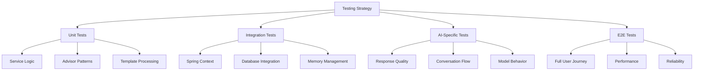

# 🧪 Testing Guide: AI Applications with Spring AI

## Overview

Testing AI applications presents unique challenges compared to traditional web applications. This guide covers comprehensive testing strategies for Spring AI applications, from unit tests to integration testing and AI-specific testing patterns.

## Table of Contents
1. [Testing Challenges in AI Applications](#testing-challenges-in-ai-applications)
2. [Unit Testing Strategies](#unit-testing-strategies)
3. [Integration Testing](#integration-testing)
4. [AI-Specific Testing Patterns](#ai-specific-testing-patterns)
5. [Mocking and Test Doubles](#mocking-and-test-doubles)
6. [Performance Testing](#performance-testing)
7. [End-to-End Testing](#end-to-end-testing)

## Testing Challenges in AI Applications

### Unique Challenges

AI applications have characteristics that make traditional testing approaches insufficient:

1. **Non-Deterministic Responses** - Same input can produce different outputs
2. **External Dependencies** - AI APIs are external services with latency and cost
3. **Response Quality** - How do you assert on response quality?
4. **Context Sensitivity** - Responses depend on conversation history
5. **Cost Implications** - Running tests against real APIs is expensive

### Testing Strategy Overview



## Unit Testing Strategies

### 1. Testing Service Layer Logic

#### ChatService Unit Tests
```java
@ExtendWith(MockitoExtension.class)
class ChatServiceTest {
    
    @Mock
    private ChatClient chatClient;
    
    @Mock
    private ChatMemory chatMemory;
    
    @Mock
    private ChatClient.ChatClientRequestSpec requestSpec;
    
    @Mock
    private ChatClient.CallPromptSpec callPromptSpec;
    
    @Mock
    private ChatResponse chatResponse;
    
    @InjectMocks
    private ChatService chatService;
    
    @Test
    void shouldProcessMessageSuccessfully() {
        // Given
        String conversationId = "test-123";
        String userMessage = "Hello, AI!";
        String expectedResponse = "Hello! How can I help you today?";
        
        when(chatClient.prompt()).thenReturn(requestSpec);
        when(requestSpec.user(userMessage)).thenReturn(callPromptSpec);
        when(callPromptSpec.advisors(any())).thenReturn(callPromptSpec);
        when(callPromptSpec.call()).thenReturn(chatResponse);
        when(chatResponse.getResult()).thenReturn(createMockResult(expectedResponse));
        
        // When
        String actualResponse = chatService.processMessage(conversationId, userMessage);
        
        // Then
        assertThat(actualResponse).isEqualTo(expectedResponse);
        verify(chatClient).prompt();
        verify(requestSpec).user(userMessage);
        verify(callPromptSpec).advisors(any());
    }
    
    @Test
    void shouldHandleErrorsGracefully() {
        // Given
        String conversationId = "test-123";
        String userMessage = "Hello";
        
        when(chatClient.prompt()).thenReturn(requestSpec);
        when(requestSpec.user(userMessage)).thenReturn(callPromptSpec);
        when(callPromptSpec.advisors(any())).thenReturn(callPromptSpec);
        when(callPromptSpec.call()).thenThrow(new RuntimeException("API Error"));
        
        // When & Then
        assertThatThrownBy(() -> chatService.processMessage(conversationId, userMessage))
            .isInstanceOf(ChatServiceException.class)
            .hasMessageContaining("Failed to process message");
    }
    
    @Test
    void shouldApplyCorrectAdvisors() {
        // Given
        String conversationId = "test-123";
        String userMessage = "Test message";
        ArgumentCaptor<Function<ChatClient.AdvisorSpec, ChatClient.AdvisorSpec>> advisorCaptor = 
            ArgumentCaptor.forClass(Function.class);
        
        when(chatClient.prompt()).thenReturn(requestSpec);
        when(requestSpec.user(userMessage)).thenReturn(callPromptSpec);
        when(callPromptSpec.advisors(advisorCaptor.capture())).thenReturn(callPromptSpec);
        when(callPromptSpec.call()).thenReturn(chatResponse);
        when(chatResponse.getResult()).thenReturn(createMockResult("Response"));
        
        // When
        chatService.processMessage(conversationId, userMessage);
        
        // Then
        verify(callPromptSpec).advisors(any());
        // Additional verification of advisor configuration if needed
    }
    
    private Generation createMockResult(String content) {
        return new Generation(new AssistantMessage(content));
    }
}
```

### 2. Testing Advisor Patterns

#### Custom Advisor Testing
```java
@ExtendWith(MockitoExtension.class)
class LoggingAdvisorTest {
    
    @Mock
    private CallAroundChain mockChain;
    
    @Captor
    private ArgumentCaptor<AdvisedRequest> requestCaptor;
    
    private LoggingAdvisor loggingAdvisor;
    
    @BeforeEach
    void setUp() {
        loggingAdvisor = new LoggingAdvisor();
    }
    
    @Test
    void shouldLogRequestAndResponse() {
        // Given
        AdvisedRequest request = createMockRequest("Test message", "conv-123");
        AdvisedResponse expectedResponse = createMockResponse("Test response");
        
        when(mockChain.nextAroundAdvise(any())).thenReturn(expectedResponse);
        
        // When
        AdvisedResponse actualResponse = loggingAdvisor.advise(request, mockChain);
        
        // Then
        assertThat(actualResponse).isEqualTo(expectedResponse);
        verify(mockChain).nextAroundAdvise(requestCaptor.capture());
        
        AdvisedRequest capturedRequest = requestCaptor.getValue();
        assertThat(capturedRequest).isEqualTo(request);
        
        // Verify logging occurred (using log testing framework like Logback test)
        // assertThat(logEvents).hasSize(2); // Request and response logs
    }
    
    @Test
    void shouldHandleAdvisorChainErrors() {
        // Given
        AdvisedRequest request = createMockRequest("Test message", "conv-123");
        RuntimeException chainError = new RuntimeException("Chain failed");
        
        when(mockChain.nextAroundAdvise(any())).thenThrow(chainError);
        
        // When & Then
        assertThatThrownBy(() -> loggingAdvisor.advise(request, mockChain))
            .isEqualTo(chainError);
    }
    
    private AdvisedRequest createMockRequest(String message, String conversationId) {
        List<Message> messages = List.of(new UserMessage(message));
        Prompt prompt = new Prompt(messages);
        Map<String, Object> context = Map.of(ChatMemory.CONVERSATION_ID, conversationId);
        return new AdvisedRequest(prompt, context);
    }
    
    private AdvisedResponse createMockResponse(String content) {
        Generation generation = new Generation(new AssistantMessage(content));
        ChatResponse chatResponse = new ChatResponse(List.of(generation));
        return new AdvisedResponse(chatResponse);
    }
}
```

### 3. Testing Template Processing

#### Template Engine Testing
```java
@ExtendWith(MockitoExtension.class)
class PromptTemplateServiceTest {
    
    @Mock
    private ChatClient chatClient;
    
    @Mock
    private ChatClient.ChatClientRequestSpec requestSpec;
    
    @Mock
    private ChatClient.CallPromptSpec callPromptSpec;
    
    @Mock
    private ChatResponse chatResponse;
    
    private PromptTemplateService templateService;
    private Map<String, TemplateDefinition> templates;
    
    @BeforeEach
    void setUp() {
        templates = createTestTemplates();
        templateService = new PromptTemplateService(chatClient, templates);
    }
    
    @Test
    void shouldExecuteTemplateWithVariableSubstitution() {
        // Given
        String templateName = "code-review";
        Map<String, Object> variables = Map.of(
            "code", "public void test() {}",
            "language", "java",
            "focus", List.of("security", "performance")
        );
        
        when(chatClient.prompt()).thenReturn(requestSpec);
        when(requestSpec.system(anyString())).thenReturn(callPromptSpec);
        when(callPromptSpec.user(anyString())).thenReturn(callPromptSpec);
        when(callPromptSpec.call()).thenReturn(chatResponse);
        when(chatResponse.getResult()).thenReturn(createMockResult("Code looks good!"));
        
        // When
        String result = templateService.execute(templateName, variables);
        
        // Then
        assertThat(result).isEqualTo("Code looks good!");
        
        // Verify template variables were properly substituted
        ArgumentCaptor<String> systemPromptCaptor = ArgumentCaptor.forClass(String.class);
        ArgumentCaptor<String> userPromptCaptor = ArgumentCaptor.forClass(String.class);
        
        verify(requestSpec).system(systemPromptCaptor.capture());
        verify(callPromptSpec).user(userPromptCaptor.capture());
        
        String systemPrompt = systemPromptCaptor.getValue();
        String userPrompt = userPromptCaptor.getValue();
        
        assertThat(userPrompt).contains("java");
        assertThat(userPrompt).contains("public void test() {}");
    }
    
    @Test
    void shouldThrowExceptionForMissingTemplate() {
        // Given
        String invalidTemplate = "non-existent";
        Map<String, Object> variables = Map.of();
        
        // When & Then
        assertThatThrownBy(() -> templateService.execute(invalidTemplate, variables))
            .isInstanceOf(TemplateNotFoundException.class)
            .hasMessageContaining("non-existent");
    }
    
    @Test
    void shouldValidateRequiredVariables() {
        // Given
        String templateName = "code-review";
        Map<String, Object> incompleteVariables = Map.of("language", "java");
        // Missing required "code" variable
        
        // When & Then
        assertThatThrownBy(() -> templateService.execute(templateName, incompleteVariables))
            .isInstanceOf(TemplateValidationException.class)
            .hasMessageContaining("code");
    }
    
    private Map<String, TemplateDefinition> createTestTemplates() {
        TemplateDefinition codeReview = TemplateDefinition.builder("code-review")
            .systemPrompt("You are a code reviewer focusing on {focus}")
            .userPrompt("Review this {language} code: {code}")
            .requiredVariable("code")
            .requiredVariable("language")
            .build();
            
        return Map.of("code-review", codeReview);
    }
}
```

## Integration Testing

### 1. Spring Boot Integration Tests

#### Complete Application Context Testing
```java
@SpringBootTest
@TestPropertySource(properties = {
    "spring.ai.openai.api-key=test-key",
    "spring.ai.openai.base-url=http://localhost:8080/mock-ai"
})
class ChatControllerIntegrationTest {
    
    @Autowired
    private TestRestTemplate restTemplate;
    
    @Autowired
    private ChatService chatService;
    
    @MockBean
    private ChatClient chatClient;
    
    @Test
    void shouldHandleNewConversationRequest() {
        // Given
        ChatRequest request = new ChatRequest("Hello, world!");
        mockChatClientResponse("Hello! How can I help you today?");
        
        // When
        ResponseEntity<ChatResponse> response = restTemplate.postForEntity(
            "/api/chat/new",
            request,
            ChatResponse.class
        );
        
        // Then
        assertThat(response.getStatusCode()).isEqualTo(HttpStatus.OK);
        assertThat(response.getBody()).isNotNull();
        assertThat(response.getBody().getMessage()).isEqualTo("Hello! How can I help you today?");
        assertThat(response.getBody().getConversationId()).isNotNull();
    }
    
    @Test
    void shouldMaintainConversationContext() {
        // Given
        String conversationId = createConversation("My name is Alice");
        ChatRequest followUpRequest = new ChatRequest("What's my name?");
        mockChatClientResponse("Your name is Alice.");
        
        // When
        ResponseEntity<ChatResponse> response = restTemplate.postForEntity(
            "/api/chat/" + conversationId,
            followUpRequest,
            ChatResponse.class
        );
        
        // Then
        assertThat(response.getStatusCode()).isEqualTo(HttpStatus.OK);
        assertThat(response.getBody().getMessage()).contains("Alice");
    }
    
    @Test
    void shouldHandleValidationErrors() {
        // Given
        ChatRequest invalidRequest = new ChatRequest(""); // Empty message
        
        // When
        ResponseEntity<ErrorResponse> response = restTemplate.postForEntity(
            "/api/chat/new",
            invalidRequest,
            ErrorResponse.class
        );
        
        // Then
        assertThat(response.getStatusCode()).isEqualTo(HttpStatus.BAD_REQUEST);
        assertThat(response.getBody().getMessage()).contains("validation");
    }
    
    private void mockChatClientResponse(String responseContent) {
        when(chatClient.prompt()).thenReturn(mock(ChatClient.ChatClientRequestSpec.class));
        // Complete mocking chain...
    }
    
    private String createConversation(String initialMessage) {
        ChatRequest request = new ChatRequest(initialMessage);
        mockChatClientResponse("Hello Alice!");
        
        ResponseEntity<ChatResponse> response = restTemplate.postForEntity(
            "/api/chat/new",
            request,
            ChatResponse.class
        );
        
        return response.getBody().getConversationId();
    }
}
```

### 2. Database Integration Testing

#### Memory Persistence Testing
```java
@SpringBootTest
@ActiveProfiles("jdbc")
@Transactional
class ChatMemoryIntegrationTest {
    
    @Autowired
    private ChatMemoryRepository chatMemoryRepository;
    
    @Autowired
    private ChatMemory chatMemory;
    
    @Test
    void shouldPersistConversationMessages() {
        // Given
        String conversationId = "test-conversation";
        Message userMessage = new UserMessage("Hello");
        Message assistantMessage = new AssistantMessage("Hi there!");
        
        // When
        chatMemory.add(conversationId, userMessage);
        chatMemory.add(conversationId, assistantMessage);
        
        // Then
        List<Message> retrievedMessages = chatMemory.get(conversationId);
        assertThat(retrievedMessages).hasSize(2);
        assertThat(retrievedMessages.get(0).getContent()).isEqualTo("Hello");
        assertThat(retrievedMessages.get(1).getContent()).isEqualTo("Hi there!");
    }
    
    @Test
    void shouldRespectWindowSizeLimit() {
        // Given
        String conversationId = "window-test";
        int windowSize = 5;
        
        // When - Add more messages than window size
        for (int i = 0; i < 10; i++) {
            chatMemory.add(conversationId, new UserMessage("Message " + i));
        }
        
        // Then
        List<Message> messages = chatMemory.get(conversationId);
        assertThat(messages.size()).isLessThanOrEqualTo(windowSize);
        
        // Should contain the most recent messages
        assertThat(messages.get(messages.size() - 1).getContent()).isEqualTo("Message 9");
    }
    
    @Test
    void shouldClearConversationMemory() {
        // Given
        String conversationId = "clear-test";
        chatMemory.add(conversationId, new UserMessage("Test message"));
        assertThat(chatMemory.get(conversationId)).isNotEmpty();
        
        // When
        chatMemory.clear(conversationId);
        
        // Then
        assertThat(chatMemory.get(conversationId)).isEmpty();
    }
}
```

### 3. TestContainers for Real Database Testing

#### PostgreSQL Integration Testing
```java
@SpringBootTest
@Testcontainers
class DatabaseIntegrationTest {
    
    @Container
    static PostgreSQLContainer<?> postgres = new PostgreSQLContainer<>("postgres:14")
            .withDatabaseName("testdb")
            .withUsername("test")
            .withPassword("test");
    
    @DynamicPropertySource
    static void configureProperties(DynamicPropertyRegistry registry) {
        registry.add("spring.datasource.url", postgres::getJdbcUrl);
        registry.add("spring.datasource.username", postgres::getUsername);
        registry.add("spring.datasource.password", postgres::getPassword);
    }
    
    @Autowired
    private ChatMemoryRepository repository;
    
    @Test
    void shouldWorkWithRealDatabase() {
        // Given
        String conversationId = "real-db-test";
        
        // When
        repository.add(conversationId, List.of(new UserMessage("Test")));
        
        // Then
        List<Message> messages = repository.get(conversationId);
        assertThat(messages).hasSize(1);
        assertThat(messages.get(0).getContent()).isEqualTo("Test");
    }
}
```

## AI-Specific Testing Patterns

### 1. Response Quality Testing

#### Semantic Similarity Testing
```java
@Component
public class ResponseQualityTester {
    private final EmbeddingClient embeddingClient;
    
    public double calculateSimilarity(String expected, String actual) {
        List<float[]> expectedEmbedding = embeddingClient.embed(List.of(expected));
        List<float[]> actualEmbedding = embeddingClient.embed(List.of(actual));
        
        return cosineSimilarity(expectedEmbedding.get(0), actualEmbedding.get(0));
    }
    
    public boolean containsKeyInformation(String response, List<String> keyPoints) {
        String responseLower = response.toLowerCase();
        return keyPoints.stream()
            .allMatch(point -> responseLower.contains(point.toLowerCase()));
    }
    
    public ResponseQuality analyzeResponse(String prompt, String response) {
        return ResponseQuality.builder()
            .length(response.length())
            .hasStructure(hasStructure(response))
            .hasExamples(hasExamples(response))
            .toxicityScore(calculateToxicity(response))
            .relevanceScore(calculateRelevance(prompt, response))
            .build();
    }
    
    private double cosineSimilarity(float[] a, float[] b) {
        double dotProduct = 0.0;
        double normA = 0.0;
        double normB = 0.0;
        
        for (int i = 0; i < a.length; i++) {
            dotProduct += a[i] * b[i];
            normA += Math.pow(a[i], 2);
            normB += Math.pow(b[i], 2);
        }
        
        return dotProduct / (Math.sqrt(normA) * Math.sqrt(normB));
    }
}

@Test
void shouldProvideRelevantResponse() {
    // Given
    String prompt = "Explain machine learning in simple terms";
    String expectedKeywords = List.of("algorithm", "data", "pattern", "prediction");
    
    // When
    String response = chatService.processMessage("test", prompt);
    
    // Then
    ResponseQuality quality = responseQualityTester.analyzeResponse(prompt, response);
    assertThat(quality.getRelevanceScore()).isGreaterThan(0.7);
    assertThat(responseQualityTester.containsKeyInformation(response, expectedKeywords)).isTrue();
}
```

### 2. Conversation Flow Testing

#### Multi-Turn Conversation Testing
```java
@Test
void shouldMaintainContextAcrossMultipleTurns() {
    // Given
    String conversationId = "context-test";
    
    // Setup conversation scenario
    ConversationScenario scenario = ConversationScenario.builder()
        .turn("My favorite color is blue", response -> assertThat(response).isNotNull())
        .turn("What's my favorite color?", response -> 
            assertThat(response.toLowerCase()).contains("blue"))
        .turn("Why do you think I like that color?", response -> 
            assertThat(response.toLowerCase()).contains("blue"))
        .build();
    
    // When & Then
    scenario.execute(conversationId, chatService);
}

public class ConversationScenario {
    private final List<ConversationTurn> turns;
    
    public static class Builder {
        private List<ConversationTurn> turns = new ArrayList<>();
        
        public Builder turn(String input, Consumer<String> assertion) {
            turns.add(new ConversationTurn(input, assertion));
            return this;
        }
        
        public ConversationScenario build() {
            return new ConversationScenario(turns);
        }
    }
    
    public void execute(String conversationId, ChatService chatService) {
        for (ConversationTurn turn : turns) {
            String response = chatService.processMessage(conversationId, turn.input());
            turn.assertion().accept(response);
        }
    }
    
    private record ConversationTurn(String input, Consumer<String> assertion) {}
}
```

### 3. Model Behavior Testing

#### Consistency Testing
```java
@Test
void shouldProduceConsistentResponsesForSameInput() {
    // Given
    String input = "What is 2 + 2?";
    int trials = 5;
    List<String> responses = new ArrayList<>();
    
    // When
    for (int i = 0; i < trials; i++) {
        String response = chatService.processMessage("consistency-test-" + i, input);
        responses.add(response);
    }
    
    // Then
    // All responses should contain "4"
    assertThat(responses).allSatisfy(response -> 
        assertThat(response).contains("4"));
    
    // Responses should be similar (using semantic similarity)
    for (int i = 1; i < responses.size(); i++) {
        double similarity = responseQualityTester.calculateSimilarity(
            responses.get(0), responses.get(i));
        assertThat(similarity).isGreaterThan(0.8);
    }
}
```

## Mocking and Test Doubles

### 1. ChatClient Mocking Patterns

#### Comprehensive ChatClient Mock
```java
@Component
public class MockChatClientBuilder {
    
    public static ChatClient createMockChatClient() {
        ChatClient chatClient = mock(ChatClient.class);
        ChatClient.ChatClientRequestSpec requestSpec = mock(ChatClient.ChatClientRequestSpec.class);
        ChatClient.CallPromptSpec callPromptSpec = mock(ChatClient.CallPromptSpec.class);
        ChatResponse chatResponse = mock(ChatResponse.class);
        
        when(chatClient.prompt()).thenReturn(requestSpec);
        when(requestSpec.system(anyString())).thenReturn(callPromptSpec);
        when(requestSpec.user(anyString())).thenReturn(callPromptSpec);
        when(callPromptSpec.advisors(any())).thenReturn(callPromptSpec);
        when(callPromptSpec.options(any())).thenReturn(callPromptSpec);
        when(callPromptSpec.call()).thenReturn(chatResponse);
        
        return chatClient;
    }
    
    public static void setupResponse(ChatClient mockClient, String response) {
        ChatResponse chatResponse = mock(ChatResponse.class);
        Generation generation = new Generation(new AssistantMessage(response));
        
        when(chatResponse.getResult()).thenReturn(generation);
        
        // Navigate through the mock chain to set up the response
        ChatClient.ChatClientRequestSpec requestSpec = mock(ChatClient.ChatClientRequestSpec.class);
        ChatClient.CallPromptSpec callPromptSpec = mock(ChatClient.CallPromptSpec.class);
        
        when(mockClient.prompt()).thenReturn(requestSpec);
        when(requestSpec.user(anyString())).thenReturn(callPromptSpec);
        when(callPromptSpec.call()).thenReturn(chatResponse);
    }
    
    public static void setupStreamingResponse(ChatClient mockClient, List<String> chunks) {
        Flux<String> streamFlux = Flux.fromIterable(chunks);
        
        ChatClient.StreamCallPromptSpec streamSpec = mock(ChatClient.StreamCallPromptSpec.class);
        ChatClient.StreamContentSpec contentSpec = mock(ChatClient.StreamContentSpec.class);
        
        when(streamSpec.content()).thenReturn(contentSpec);
        when(contentSpec.stream()).thenReturn(streamFlux);
        
        // Wire up the mocking chain for streaming
        // ... additional setup
    }
}
```

### 2. AI Provider Test Doubles

#### Fake AI Provider for Testing
```java
@Component
@Profile("test")
public class FakeAIProvider implements ChatClient {
    private final Map<String, String> responseMap;
    private final Random random = new Random();
    
    public FakeAIProvider() {
        this.responseMap = createPredefinedResponses();
    }
    
    @Override
    public ChatClientRequestSpec prompt() {
        return new FakeChatClientRequestSpec();
    }
    
    private class FakeChatClientRequestSpec implements ChatClientRequestSpec {
        private String userMessage;
        private String systemMessage;
        
        @Override
        public CallPromptSpec user(String message) {
            this.userMessage = message;
            return new FakeCallPromptSpec();
        }
        
        @Override
        public CallPromptSpec system(String message) {
            this.systemMessage = message;
            return new FakeCallPromptSpec();
        }
        
        private class FakeCallPromptSpec implements CallPromptSpec {
            
            @Override
            public ChatResponse call() {
                String response = generateFakeResponse(userMessage);
                Generation generation = new Generation(new AssistantMessage(response));
                return new ChatResponse(List.of(generation));
            }
            
            @Override
            public CallPromptSpec advisors(Function<AdvisorSpec, AdvisorSpec> advisorConfigurer) {
                return this;
            }
        }
    }
    
    private String generateFakeResponse(String input) {
        // Simple rule-based responses for testing
        String inputLower = input.toLowerCase();
        
        if (inputLower.contains("hello") || inputLower.contains("hi")) {
            return "Hello! How can I help you today?";
        } else if (inputLower.contains("name")) {
            return "My name is Test AI Assistant.";
        } else if (inputLower.contains("weather")) {
            return "I don't have access to current weather data.";
        } else {
            return "I understand your question about: " + input;
        }
    }
    
    private Map<String, String> createPredefinedResponses() {
        return Map.of(
            "what is 2+2", "2 + 2 equals 4.",
            "explain ai", "AI is artificial intelligence...",
            "hello world", "Hello! Welcome to the world of AI!"
        );
    }
}
```

## Performance Testing

### 1. Load Testing for AI Endpoints

#### JMeter-style Load Testing
```java
@SpringBootTest(webEnvironment = SpringBootTest.WebEnvironment.RANDOM_PORT)
class ChatLoadTest {
    
    @Autowired
    private TestRestTemplate restTemplate;
    
    @Test
    void shouldHandleHighConcurrentLoad() throws InterruptedException {
        int numberOfThreads = 20;
        int requestsPerThread = 10;
        CountDownLatch latch = new CountDownLatch(numberOfThreads);
        ExecutorService executor = Executors.newFixedThreadPool(numberOfThreads);
        
        List<CompletableFuture<LoadTestResult>> futures = new ArrayList<>();
        
        for (int i = 0; i < numberOfThreads; i++) {
            final int threadId = i;
            CompletableFuture<LoadTestResult> future = CompletableFuture.supplyAsync(() -> {
                LoadTestResult result = new LoadTestResult();
                
                try {
                    for (int j = 0; j < requestsPerThread; j++) {
                        long startTime = System.currentTimeMillis();
                        
                        ChatRequest request = new ChatRequest("Test message " + threadId + "-" + j);
                        ResponseEntity<ChatResponse> response = restTemplate.postForEntity(
                            "/api/chat/new", request, ChatResponse.class);
                        
                        long duration = System.currentTimeMillis() - startTime;
                        
                        result.addRequest(response.getStatusCode(), duration);
                    }
                } catch (Exception e) {
                    result.addError(e);
                } finally {
                    latch.countDown();
                }
                
                return result;
            }, executor);
            
            futures.add(future);
        }
        
        latch.await(5, TimeUnit.MINUTES);
        
        // Analyze results
        List<LoadTestResult> results = futures.stream()
            .map(CompletableFuture::join)
            .collect(Collectors.toList());
        
        long totalRequests = results.stream().mapToLong(LoadTestResult::getTotalRequests).sum();
        long successfulRequests = results.stream().mapToLong(LoadTestResult::getSuccessfulRequests).sum();
        double averageResponseTime = results.stream()
            .mapToDouble(LoadTestResult::getAverageResponseTime)
            .average()
            .orElse(0.0);
        
        // Assertions
        assertThat(successfulRequests).isEqualTo(totalRequests);
        assertThat(averageResponseTime).isLessThan(5000); // 5 second SLA
        
        logger.info("Load test completed: {} requests, {}ms avg response time", 
                   totalRequests, averageResponseTime);
    }
    
    private static class LoadTestResult {
        private int totalRequests = 0;
        private int successfulRequests = 0;
        private List<Long> responseTimes = new ArrayList<>();
        private List<Exception> errors = new ArrayList<>();
        
        public void addRequest(HttpStatus status, long duration) {
            totalRequests++;
            responseTimes.add(duration);
            if (status.is2xxSuccessful()) {
                successfulRequests++;
            }
        }
        
        public void addError(Exception e) {
            errors.add(e);
        }
        
        public double getAverageResponseTime() {
            return responseTimes.stream().mapToLong(Long::longValue).average().orElse(0.0);
        }
        
        // Getters...
    }
}
```

### 2. Memory Usage Testing

#### Memory Leak Detection
```java
@Test
void shouldNotLeakMemoryDuringLongConversations() {
    // Given
    String conversationId = "memory-test";
    Runtime runtime = Runtime.getRuntime();
    
    // Measure initial memory
    System.gc();
    long initialMemory = runtime.totalMemory() - runtime.freeMemory();
    
    // When - Simulate long conversation
    for (int i = 0; i < 1000; i++) {
        chatService.processMessage(conversationId, "Message " + i);
        
        if (i % 100 == 0) {
            System.gc();
            long currentMemory = runtime.totalMemory() - runtime.freeMemory();
            long memoryIncrease = currentMemory - initialMemory;
            
            // Memory increase should be bounded
            assertThat(memoryIncrease).isLessThan(100_000_000); // 100MB limit
        }
    }
    
    // Then - Final memory check
    System.gc();
    long finalMemory = runtime.totalMemory() - runtime.freeMemory();
    long totalIncrease = finalMemory - initialMemory;
    
    assertThat(totalIncrease).isLessThan(200_000_000); // 200MB total limit
}
```

## End-to-End Testing

### 1. Full User Journey Testing

#### Selenium WebDriver Testing
```java
@SpringBootTest(webEnvironment = SpringBootTest.WebEnvironment.DEFINED_PORT)
class ChatApplicationE2ETest {
    
    private WebDriver driver;
    
    @BeforeEach
    void setUp() {
        ChromeOptions options = new ChromeOptions();
        options.addArguments("--headless");
        driver = new ChromeDriver(options);
    }
    
    @AfterEach
    void tearDown() {
        if (driver != null) {
            driver.quit();
        }
    }
    
    @Test
    void shouldCompleteFullChatConversation() {
        // Given
        driver.get("http://localhost:8080/chat");
        
        // When - Start conversation
        WebElement messageInput = driver.findElement(By.id("message-input"));
        WebElement sendButton = driver.findElement(By.id("send-button"));
        
        messageInput.sendKeys("Hello, my name is Alice");
        sendButton.click();
        
        // Wait for response
        WebDriverWait wait = new WebDriverWait(driver, Duration.ofSeconds(30));
        WebElement firstResponse = wait.until(
            ExpectedConditions.presenceOfElementLocated(By.className("ai-response")));
        
        // Then - Verify first response
        assertThat(firstResponse.getText()).isNotEmpty();
        
        // When - Continue conversation
        messageInput.clear();
        messageInput.sendKeys("What's my name?");
        sendButton.click();
        
        // Wait for follow-up response
        List<WebElement> responses = wait.until(
            driver -> driver.findElements(By.className("ai-response")));
        
        // Then - Verify context was maintained
        assertThat(responses).hasSizeGreaterThan(1);
        WebElement secondResponse = responses.get(responses.size() - 1);
        assertThat(secondResponse.getText().toLowerCase()).contains("alice");
    }
    
    @Test
    void shouldHandleStreamingResponses() {
        // Given
        driver.get("http://localhost:8080/chat");
        
        // When
        WebElement messageInput = driver.findElement(By.id("message-input"));
        messageInput.sendKeys("Write a short story");
        driver.findElement(By.id("send-button")).click();
        
        // Then - Verify streaming behavior
        WebDriverWait wait = new WebDriverWait(driver, Duration.ofSeconds(60));
        WebElement responseArea = wait.until(
            ExpectedConditions.presenceOfElementLocated(By.id("response-area")));
        
        // Check that content appears progressively
        String previousContent = "";
        for (int i = 0; i < 10; i++) {
            try {
                Thread.sleep(500);
                String currentContent = responseArea.getText();
                assertThat(currentContent.length()).isGreaterThanOrEqualTo(previousContent.length());
                previousContent = currentContent;
            } catch (InterruptedException e) {
                Thread.currentThread().interrupt();
                fail("Test interrupted");
            }
        }
    }
}
```

## Key Takeaways

1. **Layer your testing strategy** - Unit, integration, and E2E tests serve different purposes
2. **Mock external dependencies** - AI APIs should be mocked for fast, reliable tests
3. **Test AI-specific concerns** - Response quality, context maintenance, and consistency
4. **Use semantic testing** - Compare meaning, not exact text matches
5. **Test performance characteristics** - AI applications have unique performance profiles
6. **Validate conversation flows** - Multi-turn interactions are critical
7. **Monitor resource usage** - Memory leaks are common in conversation applications

## Next Steps

- 📄 [Production Guide](production.md) - Deployment strategies
- 📄 [Troubleshooting Guide](troubleshooting.md) - Common issues and solutions
- 🏗️ [Performance Guide](../architecture/performance.md) - Optimization strategies

---

[← Quick Start](quick-start.md) | [Back to Guides](../README.md#practical-guides) | [Production Guide →](production.md)